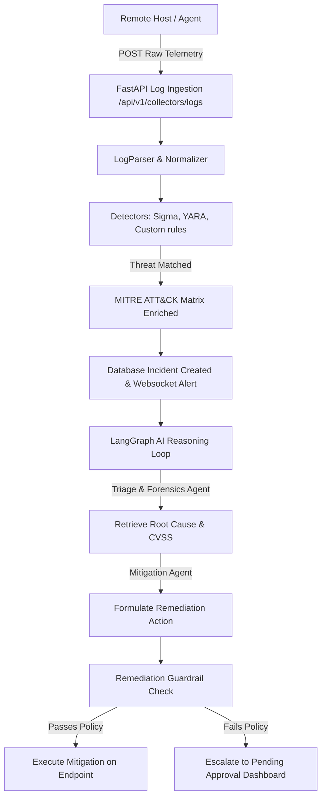

# SentinelAI 🛡️

**SentinelAI** is an AI-powered autonomous threat detection, incident triage, and remediation platform. It continuously ingests endpoint logs, standardizes host/network events, matches threat patterns against Sigma and YARA definitions, and dispatches detected indicators to an advanced multi-agent LangGraph workflow for autonomous forensic reasoning and remediation.

---

## 🌟 Key Features

1. **Host & Network Event Collection**: Out-of-the-box support for Linux syslog, `auth.log`, `auditd` syscall audits, Windows Security events, Sysmon, NetFlow packets, and bandwidth monitoring.
2. **Threat Signal Normalization**: Dedicated log parsing engine that standardizes unstructured telemetry streams into a unified JSON format.
3. **Hybrid Detection Engine**: Combines signature-based scanning (YARA rules), logic matching (Sigma definitions), and anomaly rules (execution from temp directories, file encryption spikes, defense evasion commands).
4. **MITRE ATT&CK Mapping**: Maps threat vectors to standard MITRE IDs (T1110, T1204, T1548, T1486, T1562) to determine the baseline risk profile.
5. **AI reasoning Layer**: A LangGraph multi-agent team (Triage, Forensics, Severity, Remediation) that evaluates root causes, scores threat risks, and outlines precise mitigation plans.
6. **Remediation Guardrails**: Prevents unauthorized execution of dangerous CLI shell scripts through a whitelisting system.

---

## 📁 Repository Structure

```
sentinel-ai/
├── ai_engine/           # Multi-agent LangGraph flows (Triage, Forensics, Severity, Mitigation)
├── backend/             # FastAPI REST endpoint server, SQLite databases, integration tests
├── collectors/          # OS-specific log collectors, parser/normalization modules
├── detection_engine/    # Sigma YAML rule matches, YARA scanners, MITRE mapping
├── docs/                # Architecture specifications, API endpoints, threat models
├── frontend/            # Next.js / React interactive SOC security dashboard
├── remediation/         # Shell mitigation command execution and safety guardrails
└── README.md            # Root configuration and onboarding instructions
```

---

## ⚙️ Installation & Setup

### Prerequisites
- Python 3.10+
- Node.js 18+ (with npm)

### 1. Backend Server Setup
1. Open a terminal and navigate to the backend directory:
   ```bash
   cd backend
   ```
2. Create and activate a Python virtual environment:
   ```bash
   python -m venv venv
   # On Windows:
   venv\Scripts\activate
   # On macOS/Linux:
   source venv/bin/activate
   ```
3. Install dependencies:
   ```bash
   pip install -r requirements.txt
   ```
4. Start the FastAPI development server:
   ```bash
   uvicorn app.main:app --reload --port 8000
   ```

### 2. Frontend Dashboard Setup
1. Open a new terminal and navigate to the frontend directory:
   ```bash
   cd frontend
   ```
2. Install Node packages:
   ```bash
   npm install
   ```
3. Launch the Next.js development server:
   ```bash
   npm run dev
   ```
4. Access the dashboard UI at [http://localhost:3000](http://localhost:3000).

---

## 🧪 Running Automated Tests

Run the integration and collector tests inside the `backend` environment:
```bash
cd backend
venv\Scripts\activate   # Activate virtualenv if not done
pytest
```

---

## 🔄 Threat Detection & Response Flow


