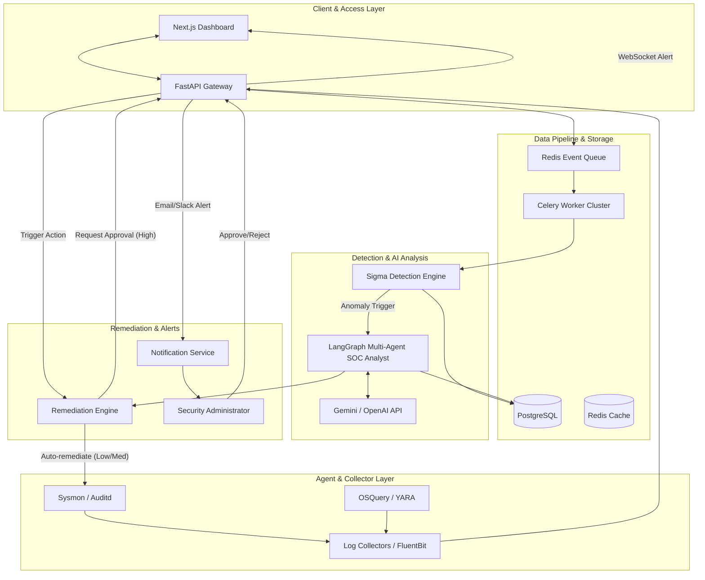

# SentinelAI System Architecture

This document provides a comprehensive technical overview of the architecture and design of **SentinelAI**, a multi-agent autonomous self-healing SOC analyst. It is designed to guide developers, security engineers, DevOps specialists, and project reviewers in understanding the system's design, security boundaries, and scalability models.

---

## Executive Summary

SentinelAI represents a paradigm shift from reactive Security Information and Event Management (SIEM) systems to active, autonomous cybersecurity remediation. Traditional security systems inundate human analysts with high-volume, low-context alerts. SentinelAI aims to solve this "alert fatigue" by operating as an automated Tier-1 and Tier-2 Security Operations Center (SOC) analyst.

By integrating traditional signature and anomaly detection tools (Sigma, YARA, OSQuery, Auditd) with advanced AI reasoning frameworks (LangChain, LangGraph, LLMs), SentinelAI continuously monitors hosts, performs deep-dive root cause investigations, classifies threat severity, and safely applies remediation actions. For critical and sensitive situations, it acts as a decision-support system, preparing recommended response actions for human-in-the-loop validation.

---

## High-Level Architecture

SentinelAI is built as a highly decoupled, service-oriented system consisting of the following architectural layers:

1. **Agent & Collector Layer (Edge)**: Lightweight telemetry agents deployed on target hosts collecting OS audit logs, process graphs, file hashes, and network flows.
2. **Ingestion & Data Pipeline Layer**: FastAPI gateways receive data streams and feed them into a high-throughput event queue.
3. **Detection & Rules Engine Layer**: Processes log events against Sigma and YARA rule bases to raise initial alerts.
4. **AI Reasoning Layer (LangGraph Agents)**: Instantiated to triage alerts, perform file system inspections, correlate historical events, and determine root cause.
5. **Remediation & Control Layer**: Executes system repairs, configuration adjustments, and containment workflows.
6. **Dashboard & Frontend Layer**: Next.js 15 single-page application providing real-time telemetry, threat visualizations, and approval workflows.

---

## System Components



### 1. Dashboard (Next.js 15)
* **Technology**: Next.js 15 (App Router), TypeScript, Tailwind CSS, ShadCN UI, Recharts, Socket.IO Client.
* **Role**: The centralized administration pane. Displays real-time security events, server health, active agent logs, incident reports, and pending remediation requests. 
* **Communication**: Communicates with the API Gateway via REST API (JSON) for standard administrative actions and WebSockets for real-time streaming of alerts and event timelines.

### 2. API Gateway (FastAPI)
* **Technology**: FastAPI, Python, WebSockets, Uvicorn.
* **Role**: Single entry point for all administrative, dashboard, and host agent communications. Authenticates users and agents, routes log ingestion payloads, serves system state, and registers pending action approvals.
* **Security**: Enforces JSON Web Tokens (JWT) for dashboard sessions and mutual TLS (mTLS) or secure API keys for agent data ingestion.

### 3. Event Pipeline
* **Technology**: Redis (Message Broker), Celery (Distributed Task Queue).
* **Role**: Handles backpressure by decoupling log ingestion from detection and analysis. Incoming log payloads are placed on the queue, and Celery workers pull and process events asynchronously.

### 4. Detection Engine
* **Technology**: Python-based rule parser, Sigma rules converter, YARA scanner.
* **Role**: Applies static rules and signature-based scanning to parsed logs. Detects matches against known threat patterns (e.g., suspicious shell execution, known malware hashes, brute-force patterns). Matches generate an "Anomaly Event" which is saved to the PostgreSQL database and immediately triggers the AI Agent Layer.

### 5. AI Agent Layer
* **Technology**: LangGraph, LangChain, Gemini API / OpenAI API, Hugging Face Transformers.
* **Role**: Coordinates a team of specialized AI agents:
  * **Triage Agent**: Assesses the raw detection trigger and scopes the investigation.
  * **Forensics Agent**: Performs root-cause query generation (e.g., executing OSQuery commands, tracing process ancestry trees).
  * **Severity Agent**: Calculates the severity vector based on CVSS metrics, asset criticality, and threat impact.
  * **Mitigation Agent**: Proposes precise remediation actions and drafts the incident summary report.
* **Execution**: Utilizes LangGraph state-charts to coordinate iterative loops of query, observation, and reasoning.

### 6. Remediation Engine
* **Technology**: Ansible (local/remote execution), Python subprocess controllers, SSH/winrm-based runners.
* **Role**: Executes remediation plans. Common actions include blocking IP addresses via `iptables`/Windows Firewall, killing malicious process IDs, quarantining files, disabling compromised user accounts, or reverting configuration changes.
* **Safety Rules**: Checks safety configuration boundaries before executing actions. Only executes automatically if the action is categorized as Low or Medium risk and matches local security policies.

### 7. Notification Service
* **Technology**: SMTP, SendGrid, Webhooks (Slack/Teams).
* **Role**: Alerts security administrators about new incidents, auto-remediation summaries, and pending approvals.

### 8. Database Layer
* **Technology**: PostgreSQL (Relational storage for server inventory, incidents, approvals, and logs), Redis (Cache store for real-time dashboards and session tokens).
* **Role**: Maintains persistent system state, configuration tables, and security logs.

---

## Data Flow

The SentinelAI end-to-end data pipeline is structured as follows:

```
[ Log Collection ] 
       │ (FluentBit/Sysmon/Auditd sends logs to API Gateway)
       ▼
[ Ingestion & Ingress ]
       │ (FastAPI validates token/API key, pushes payload to Redis)
       ▼
[ Queuing & Processing ]
       │ (Celery workers pick up raw logs from Redis queue)
       ▼
[ Detection Engine ]
       │ (Parses logs against Sigma/YARA rules)
       ├──────── [ No Match ] ──► (Discard/Store in raw archive)
       ▼ [ Rules Matched ]
[ Incident Generation ]
       │ (Saves incident state to PostgreSQL, alerts Dashboard via WebSocket)
       ▼
[ AI Agent Investigation ]
       │ (LangGraph spawns Forensics Agent to trace process tree/OSQuery)
       ▼
[ Severity Assessment ]
       │ (Calculates threat score and maps to MITRE ATT&CK)
       ▼
[ Decision Engine ]
       ├──────── [ Low/Medium Severity ] ──► [ Automated Remediation ] ──► [ Email Report ]
       ▼ [ High/Critical Severity ]
[ Escalation & Hold ]
       │ (Pause automated execution, request administrator approval)
       ▼
[ Human Interaction ]
       ├──────── [ Approved ] ──► [ Remediation Execution ] ──► [ Update Report ]
       └──────── [ Rejected ] ──► [ Quarantine Incident ] ──► [ Write Report ]
```

1. **Log Collection**: Host agents monitor log files (`/var/log/auth.log`, Windows Security Event Logs), auditd events, and Sysmon drivers. They send JSON-formatted event streams to `/api/v1/collectors/logs`.
2. **Detection**: The FastAPI gateway ingests logs, sends them to a Redis queue where Celery workers apply Sigma and YARA rules. If a match is found, an incident is created in PostgreSQL with status `TRIAGING`.
3. **AI Investigation**: A LangGraph workspace is instantiated. The Forensics Agent analyzes process ancestors, open network ports, and file modifications.
4. **Severity Classification & Decision**: The Severity Agent maps the findings to the MITRE ATT&CK matrix. The Decision Engine evaluates the remediation risk:
   * **Low/Medium Risk**: The system executes the action (e.g., blocking an IP address, killing a temporary process) and logs it.
   * **Critical Risk**: The system creates an approval request in the database, sends webhooks to Slack, and flags the incident on the dashboard.
5. **Remediation & Closure**: Once resolved (automatically or post-approval), SentinelAI generates an incident summary report and changes the incident status to `RESOLVED`.

---

## Scalability Considerations

SentinelAI is architected to handle high-throughput telemetry streams in large-scale enterprise environments:

* **Ingestion Scaling**: FastAPI runs in a stateless container configuration behind an Nginx load balancer. Kubernetes autoscalers scale up FastAPI instances based on CPU utilization and incoming HTTP request volume.
* **Data Buffer**: Redis acts as an in-memory buffer to absorb traffic spikes. In massive deployments, Redis can be swapped for a multi-node Apache Kafka cluster.
* **Celery Worker Pool**: Workers process detection rules asynchronously. They scale horizontally across independent compute nodes.
* **AI Engine Concurrency**: The LangGraph engine runs asynchronously. It utilizes caching algorithms for LLM queries (avoiding redundant LLM calls for identical alerts) and enforces semantic chunking to keep LLM context tokens to a minimum.
* **Database Partitioning**: PostgreSQL uses database partitioning on the security events table by timestamp (e.g., monthly partitions) to keep query times for dashboards and analysis fast and responsive.

---

## Security Considerations

As an autonomous agent with the power to modify systems (remediation), SentinelAI prioritizes security to prevent itself from being abused as a vector of attack:

* **Least Privilege Execution**: Host remediation is executed via specialized host agents running with restricted sudo privileges (e.g., only allowed to execute specific scripts or Ansible command subsets).
* **Sandboxed Execution**: Remediation commands undergo dry-run validation in the Remediation Engine before execution. Destructive actions on critical system databases or core system files are blocked at the code level.
* **Transport Encryption**: All communication between endpoints, dashboards, and databases uses TLS 1.3. WS connections are upgraded to WSS with token-based handshakes.
* **Immutable Logs**: Audit logs of SentinelAI actions are double-written to both the local database and a secondary read-only write-once-read-many (WORM) storage system or SIEM target.
* **AI Safety Guardrails**: AI-generated remediation commands are checked against a strict whitelist regex. The agent is never permitted to execute arbitrary shell commands typed directly by an LLM without pre-defined parsing templates.

---

## Future Improvements

* **Predictive Threat Forecasting**: Integrate locally hosted PyTorch/Scikit-Learn anomaly models that analyze baseline system behaviors to predict and block zero-day threats before rules match.
* **Federated Multi-Agent SOC**: Implement collaborative agent communication where agents on different servers exchange threat indicators (IoCs) peer-to-peer to immunize the entire subnet.
* **Lightweight Edge Detection**: Embed WebAssembly-compiled Sigma execution blocks directly inside the collectors, allowing threat detection at the edge, reducing network bandwidth usage.
