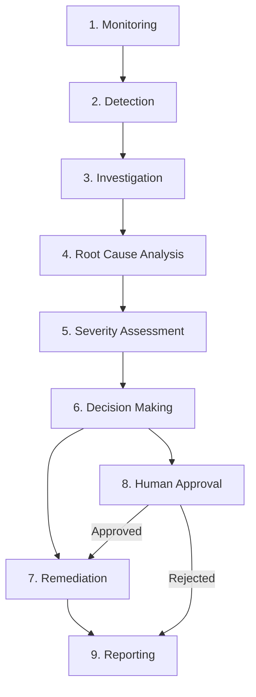
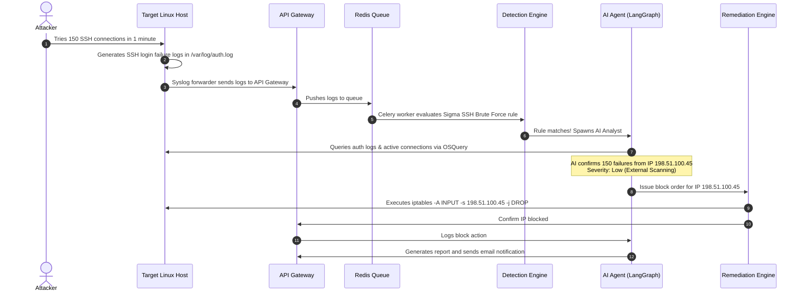
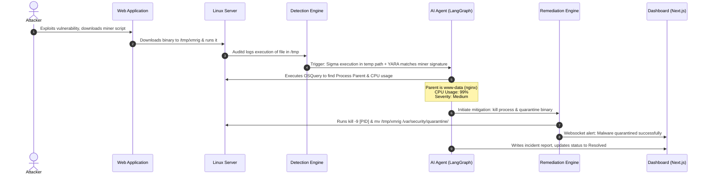
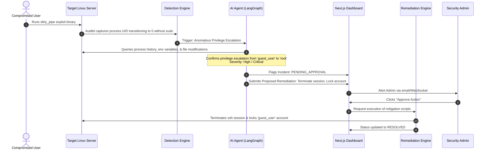
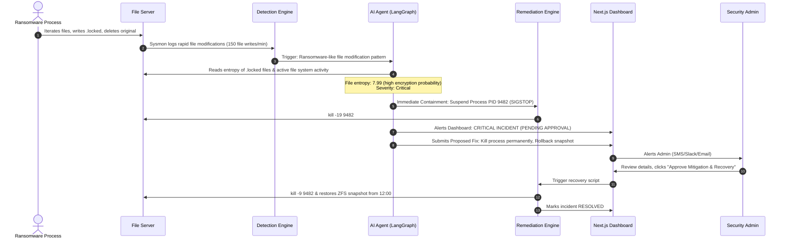

# SentinelAI Operation Workflows and Threat Lifecycle

This document describes the end-to-end operational workflows of **SentinelAI**, outlining how threats are detected, investigated by the AI Agent Layer, and remediated. It details the system's 9-stage threat lifecycle and demonstrates how the system handles four real-world threat scenarios.

---

## The Threat Lifecycle

SentinelAI processes security anomalies through a structured, 9-stage lifecycle. Each stage transitions the incident state, ensuring trace logs, forensic artifacts, and mitigation records are maintained.

### 1. Monitoring
Lightweight agents (Auditd, Sysmon, FluentBit, OSQuery) continuously track host activities. Telemetry captured includes process creations, network socket connections, file writes/deletes, authentication logs, and registry/config edits. These are structured into JSON events and forwarded to the API Gateway.

### 2. Detection
The incoming events queue in Redis. Celery workers parse the events against **Sigma Rules** (for log pattern matching) and **YARA Rules** (for file system scanning). If a rule matches, the event triggers an alert and elevates to an `Incident` in PostgreSQL with a status of `TRIAGING`.

### 3. Investigation
The system instantiates a **LangGraph Multi-Agent** session. The Triage Agent gathers metadata (host OS, running services, current timestamp, matching rule) and coordinates the investigation task list.

### 4. Root Cause Analysis (RCA)
The Forensics Agent queries the target host using dynamic tools (e.g., executing OSQuery tables like `processes`, `process_envs`, `listening_ports`, `chrome_extensions`). It traces process lineages backward (parent/child relationships) to find the entry point (e.g., a vulnerable web application, an SSH login session, or a cron job).

### 5. Severity Assessment
The Severity Agent evaluates the threat. It maps the threat to the **MITRE ATT&CK Matrix** to identify the adversary's tactic. It calculates a CVSS-like score based on:
* **Asset Criticality**: Is it a production database or a staging web server?
* **Exploitation Impact**: What permissions does the threat process have? Has data been exfiltrated?
* **Confidence Level**: How reliable is the matching signature/anomaly model?

### 6. Decision Making
The Mitigation Agent determines the response plan. It cross-references the incident's calculated severity with the host's policy engine rules:
* **Low/Medium Severity**: Automated fixes are selected and passed directly to the Remediation Engine.
* **High/Critical Severity**: The plan is compiled, but execution is paused. The incident transitions to `PENDING_APPROVAL`.

### 7. Remediation
The Remediation Engine translates the mitigation plan into host commands (e.g., Ansible Playbooks, PowerShell commands, system calls). Safe scripts execute in isolated shells to terminate processes, block network ports, quarantine files, or disable user accounts.

### 8. Human Approval
For escalated incidents, the security administrator receives a real-time WebSocket ping on the Next.js Dashboard and a webhook notification (Slack/Email). They review the AI-generated timeline, root cause, and proposed remediation script. The administrator can approve the fix, reject it, or override it with a custom action.

### 9. Reporting
After remediation, the AI Agent compiles the incident details, forensic evidence, timeline, remediation results, and recommendations into an markdown summary. This report is stored in the database, synchronized to the dashboard, and emailed to security stakeholders.

---

## Threat Scenario Walkthroughs

### Scenario 1: SSH Brute Force Attack

An attacker uses an automated tool to crack passwords on a Linux production server.

#### Step-by-Step Response:
1. **Detection**: The system logs record 150 failed password attempts for user `root` within 60 seconds. The Sigma rule `ssh_brute_force` triggers.
2. **Investigation**: The AI Triage Agent spawns. It requests active sockets from the host.
3. **Assessment**: The Severity Agent flags this as **Low Severity** (Unsuccessful authentication scans, low threat of system compromise but requires containment). It maps to MITRE ATT&CK **T1110 (Brute Force)**.
4. **Remediation**: The Mitigation Agent determines the best path is blocking the source IP. Since it is a low-risk action, it runs automatically. The Remediation Engine runs an Ansible block to update `iptables` and `/etc/hosts.deny` with the attacker's IP (`198.51.100.45`).
5. **Closure**: The agent sends an email alert to the security team showing the blocked IP and logs the incident as resolved.

---

### Scenario 2: Malware Execution (Cryptominer)

An attacker exploits an unpatched web application vulnerability to download and execute an unauthorized cryptominer.

#### Step-by-Step Response:
1. **Detection**: Auditd logs a process execution starting from `/tmp/` named `xmrig`. The files scan tool triggers a YARA match for `crypto_miner_signature`.
2. **Investigation**: The Forensics Agent runs OSQuery queries:
   * `SELECT pid, name, path, parent, cmdline FROM processes WHERE name = 'xmrig';`
   * `SELECT pid, percent_cpu_time FROM process_envs WHERE pid = [PID];`
   It finds the parent process is Nginx (`www-data` user) and the process consumes 99% CPU.
3. **Assessment**: Classified as **Medium Severity** (Malware running as service account, high resource impact). Mapped to MITRE ATT&CK **T1496 (Resource Hijacking)**.
4. **Remediation**: The system auto-terminates the process and quarantines the binary:
   * Kills process ID `32145`
   * Moves `/tmp/xmrig` to the `/var/security/quarantine/` directory
   * Permissions are set to `000` to prevent execution.
5. **Closure**: A dashboard alert notifies the team. The AI agent generates a report containing the file hash (`sha256`) and the vulnerable Nginx process tree, suggesting a patch for the application.

---

### Scenario 3: Privilege Escalation Attempt

A local system user tries to run a kernel exploit to obtain root access.

#### Step-by-Step Response:
1. **Detection**: Auditd records a process change where a user process spawned a root shell (`/bin/bash` running with `UID=0` and `EUID=0`) without any record of `sudo` or `su` execution. This matches the Sigma rule for privilege escalation.
2. **Investigation**: The Forensics Agent investigates:
   * Traces process parent hierarchy: `/bin/bash` -> `exploit_elf` -> `/home/guest_user/exploit` -> `sshd`.
   * Finds the original user account was `guest_user`.
3. **Assessment**: Mapped to MITRE ATT&CK **T1068 (Exploitation for Privilege Escalation)**. The Severity Agent flags this as **High Severity** (Root level compromise).
4. **Decision**: Due to High Severity, automatic destructive mitigation is suspended. The agent:
   * Holds the compromised process state (optionally suspends PID execution using `SIGSTOP`).
   * Posts a remediation proposal to the database: *Terminate SSH session of guest_user, lock the guest_user OS account, and kill active child processes.*
5. **Human Approval**: The security admin views the dashboard alert, checks the process trace, and clicks **Approve**.
6. **Remediation**: The Remediation Engine runs:
   * `pkill -u guest_user`
   * `passwd -l guest_user`
7. **Closure**: The incident is marked resolved. The AI agent generates a report recommending a kernel security patch to address the underlying vulnerability.

---

### Scenario 4: Ransomware Detection

An active process starts encrypting user documents in home directories and replacing files with `.locked` extensions.

#### Step-by-Step Response:
1. **Detection**: Sysmon (on Windows) or Auditd (on Linux) triggers an alert for rapid file write/delete operations (e.g., more than 100 file extensions changed to `.locked` in 10 seconds).
2. **Investigation**: The Forensics Agent acts instantly:
   * Queries the host for the offending process (`PID 9482`, `cmdline: /var/tmp/encryptor.exe`).
   * Samples three `.locked` files and calculates information entropy. The entropy is calculated at `7.99` (very close to `8.0` max), indicating high-density encryption.
3. **Assessment**: The Severity Agent classifies this as **Critical Severity** (Active ransomware attack). Mapped to MITRE ATT&CK **T1486 (Data Encrypted for Impact)**.
4. **Immediate Containment (Safe Auto-Fix)**: To prevent total data loss, the AI agent bypasses human approval *only* for process suspension:
   * Sends command to freeze the process: `kill -STOP 9482` (or Windows equivalent).
   * Freezing the process preserves forensic RAM data and stops file damage without deleting files.
5. **Decision & Escalation**: The remaining recovery steps (killing the process, deleting files, rolling back snapshots) require admin approval. A critical alert flashes on the SOC dashboard.
6. **Human Approval**: The administrator reviews the timeline, validates that the ransomware process is suspended, and clicks **Approve Recovery**.
7. **Remediation & Recovery**: The Remediation Engine:
   * Kills the ransomware process (`kill -9 9482`).
   * Quarantines `/var/tmp/encryptor.exe`.
   * Triggers a filesystem snapshot restore (e.g., ZFS/Btrfs or cloud snapshot rollback) to restore files to their pre-encryption state.
8. **Closure**: The system logs the incident status as resolved, calculates the total data recovered, and emails a detailed timeline report to management.
