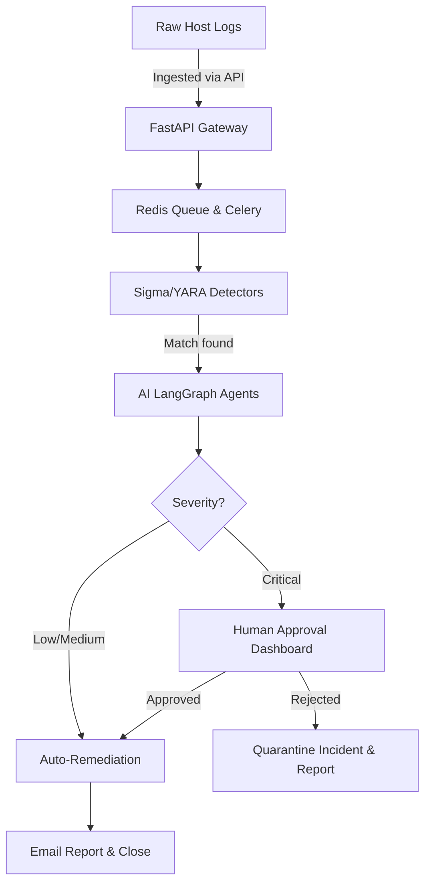

# SentinelAI - Rough Documentation Report

> [!NOTE]
> This is an automatically generated rough documentation report analyzing the current state of the SentinelAI repository. It synthesizes insights from the existing codebase, architecture docs, and project summaries.

## 1. Executive Summary
**SentinelAI** is a multi-agent autonomous self-healing SOC (Security Operations Center) analyst platform. Designed to be attached to backend servers 24/7, it continuously monitors for security threats, intelligently analyzes logs, and executes remediation actions autonomously or selectively flags critical threats for human approval.

## 2. Core Architecture
The system employs a decoupled, microservices-oriented architecture split into several tiers:

### A. Edge & Collection
- **Log Collectors**: Out-of-the-box support for Linux syslog, auth.log, auditd, Windows Security events, Sysmon, and network flow tracking.
- **Normalization Engine**: Transforms unstructured telemetry into a unified JSON format for easier analysis down the pipeline.

### B. Ingestion & Pipeline
- **API Gateway (FastAPI)**: Serves as the primary ingress point.
- **Event Queue (Redis & Celery)**: Handles backpressure and scales horizontally to analyze events asynchronously without blocking collection.

### C. Detection Engine
- **Hybrid Approach**: Combines traditional signature-based matching (Sigma & YARA rules) with anomaly detection. Matches are mapped to MITRE ATT&CK framework IDs.

### D. AI Reasoning Layer (LangGraph)
Once an anomaly is flagged, a team of intelligent agents takes over:
- **Triage Agent**: Determines the scope of the investigation.
- **Forensics Agent**: Gathers root-cause context (e.g., traces process ancestry trees).
- **Severity Agent**: Assigns a risk/severity score.
- **Mitigation Agent**: Formulates a precise remediation plan.

### E. Remediation Engine
Executes commands such as terminating processes, blocking IP addresses, or quarantining files. 
- **Low/Medium Risk**: Automatic execution.
- **High/Critical Risk**: Paused for human approval through the dashboard. 
*(Security guardrails prevent arbitrary shell executions).*

### F. Dashboard (Next.js)
A robust React/Next.js interface displaying real-time incidents, pending approvals, and system state via WebSockets.

---

## 3. Directory Structure Analysis

The repository is modular and structured efficiently:

- **`ai_engine/`**: Contains the LangGraph implementation. Subdirectories like `agents`, `llm`, `memory`, `prompts`, and `workflows` manage the autonomous reasoning layer. Specific agents include `forensics.py`, `severity_agent.py`, and `remediation_agent.py`.
- **`backend/`**: The FastAPI REST application. It includes `app/models/` for database schemas, `app/api/` for endpoints, and `sentinel.db` as the local SQLite store (though PostgreSQL is recommended for production).
- **`collectors/`**: OS-specific collectors and log parsers grouped into `linux/`, `windows/`, `network/`, and `parser/`.
- **`detection_engine/`**: Rule sets categorized by type: `sigma/`, `yara/`, and `mitre/`.
- **`frontend/`**: The Next.js 15 application utilizing TypeScript, Tailwind CSS, ShadCN UI, and Recharts for an interactive SOC experience.
- **`docs/`**: Comprehensive documentation, including architecture diagrams, APIs, threat models, and local testing guides.
- **`remediation/`**: Scripts and guardrails for safe system fixes.

---

## 4. End-to-End Threat Workflow

---

## 5. Technology Stack Summary

| Layer | Technologies |
| :--- | :--- |
| **Frontend** | Next.js 15, TypeScript, Tailwind CSS, ShadCN UI, Recharts, Socket.IO Client |
| **Backend** | FastAPI, Python 3.10+, Celery, Redis, WebSockets |
| **AI / Agents** | LangGraph, LangChain, Google Gemini / OpenAI API, Transformers |
| **Detection** | Sigma Rules, YARA, MITRE ATT&CK |
| **Data Storage** | PostgreSQL, Redis, Elasticsearch |
| **Infra/Deploy** | Docker, Kubernetes, Nginx, GitHub Actions |

---

## 6. Recommendations & Future Focus

1. **Predictive Threat Forecasting**: Enhancing the rule-based detection with local ML anomaly models (e.g., PyTorch) for zero-day threat detection.
2. **Federated Security**: Allowing independent SentinelAI instances to communicate threat indicators (IoCs) across subnets for network-wide immunity.
3. **Edge Optimization**: Pushing specific detection logic directly to the host-level collectors using WebAssembly to reduce bandwidth and API load.
